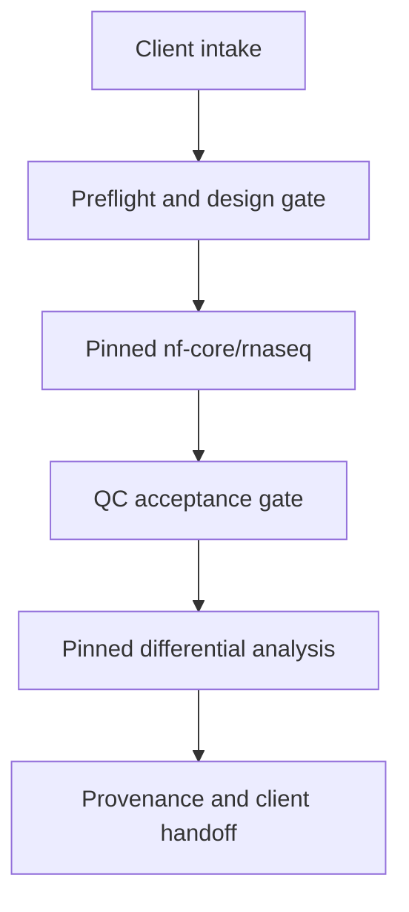

# Architecture

## Boundary

This repository is a delivery and validation layer. It does not copy or fork
the internal processes of nf-core pipelines.

Each transition creates a reviewable artifact. A later stage may not silently
change the accepted sample set or contrast direction from an earlier stage.

## Components

| Component | Responsibility |
|---|---|
| `rnaseq-service-preflight` | Validate sample, design, contrast, and optional filesystem contracts |
| workflow lock | Record exact upstream names and revisions |
| staging layer | Retrieve and checksum workflows, containers, and references |
| launch layer | Build inspectable commands and submit local/SLURM runs |
| QC gate | Turn upstream metrics into explicit accept/review/stop decisions |
| analysis handoff | Convert accepted primary outputs into locked differential-analysis inputs |
| delivery manifest | Record versions, parameters, checksums, exclusions, outputs, and limitations |

## Network modes

### Direct

The staging host can reach required registries and data sources. Compute tasks
should still consume cached, pinned artifacts whenever practical.

### Proxy

The staging process inherits standard proxy environment variables supplied at
runtime. The repository does not contain proxy hosts, usernames, passwords, or
tokens. Diagnostics must redact URL user information and must not dump the full
environment.

### Offline

Pipeline source, plugins, Apptainer images, references, and checksums are staged
before compute execution. The offline run refuses an incomplete bundle instead
of attempting an unrecorded network fallback.

## Security and privacy

- client FASTQs, alignments, counts, metadata, reports, and work directories are
  ignored by Git;
- secrets are runtime inputs and are never placed in parameter files;
- public fixtures are synthetic and contain no participant information;
- public logs must not expose client paths, signed URLs, tokens, or proxy
  credentials;
- destructive cleanup is dry-run-first and restricted to a resolved run
  directory;
- results are research-use outputs unless a separate validated clinical system
  and governance process exists.

## Reproducibility

Upstream workflow revisions are exact, not floating `latest` or development
branches. Version updates require review, synthetic validation, and a recorded
change to `config/workflows.toml`. Resumed runs retain the original workflow
revision and parameter manifest.
